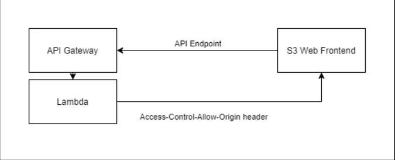

# Pulumi C# Walkthrough - Consuming Output in Frontend App

### This walkthrough builds on the [Pulumi C# Walkthrough - API Gateway](./readme02-api-gateway.md)

It is common that some of the Pulumi Output will need to be passed to the application for consumption. A typical example is the URL for the API Gateway endpoint. It is not know until after the deployment and the URL needs to be loaded by the frontend application for API invocation. We will use a minimum JavaScript app as a demo of how this is typically done.

### Create a `publish` folder for loading into the s3 bucket
### Create a index.html and runtime-config.js file in the `publish` folder
    //runtime-config.js
    window['runtime-config'] = {
        apiUrl: 'http://localhost:8080/api'
    }

    //index.html
    <!DOCTYPE html>
    <html xmlns="http://www.w3.org/1999/xhtml" xml:lang="en" lang="en">
    <head>
      <meta charset="UTF-8" />
      <title>A JS Mini App</title>
      
      
    </head>
    <body>
      <h1>JS Mini App</h1>
      <input id="my_input" value="hello" />
      <button onclick="hitTheAPI()">Click Me</button>
    </html> 

### Deploy the folder to the s3 bucket
    var objects = bucket.BucketName.Apply(bucketName=>LoadFilesToS3(@"./public", bucketName));

    private static IEnumerable<BucketObject> LoadFilesToS3(string folderPath, string bucketName)
    {
        return Directory.EnumerateFiles(folderPath)
            .Select(file=>CreateBucketObject(file, bucketName))
            .ToList();
    }
    private static BucketObject CreateBucketObject (string filePath, string bucketName)
    {
        var fileName = Path.GetFileName(filePath);
        var fileExtension = Path.GetExtension(fileName);
        var s3Object = new BucketObject(fileName, new BucketObjectArgs
        {
            Bucket = bucketName,
            Source = new FileAsset(filePath),
            Key = fileName,
            ContentType = MimeMapping(fileExtension),

        });
        return s3Object;
    }
    private static string MimeMapping(string fileExtension) => fileExtension switch
    {
        ".htm" => "text/html",
        ".html" => "text/html",
        ".js" => "application/javascript",
        _ => throw new NotImplementedException($"Mime type for {fileExtension} is not defined"),
    };
    
### Overwrite runtime-config.js in the bucket
Overwrite exiting file during the same session is not possible yet://https://github.com/pulumi/pulumi/issues/5542. As a workaround, we will have to overwrite the file while copying them to S3  

    Func<string, Output<string>?> overwriteFiles = fileName => fileName == "runtime-config.js"? url.Apply(x=>$@"window['runtime-config'] = {{apiUrl: '${x}'}}") : null;  
    var objects = bucket.BucketName.Apply(bucketName => LoadFilesToS3(@"./public", bucketName, overwriteFiles));

    private static BucketObject CreateBucketObject(string filePath, string bucketName, Func<string, Output<string>?> overwriteFiles)
    {
        var fileName = Path.GetFileName(filePath);
        var fileExtension = Path.GetExtension(fileName);
        var overWriteWith = overwriteFiles(fileName);

        var s3Object = overWriteWith switch
        {
            null => new BucketObject(fileName, new BucketObjectArgs
            {
                Bucket = bucketName,
                Source = new FileAsset(filePath),
                Key = fileName,
                ContentType = MimeMapping(fileExtension),

            }),
            _ => new BucketObject(fileName, new BucketObjectArgs
            {
                Bucket = bucketName,
                Content = overWriteWith,
                Key = fileName,
                ContentType = MimeMapping(fileExtension),

            })
        };

        return s3Object;
    }

### Enable CORS
Since our S3 index.html file and the API Gateway endpoint are from different domains, making API calls from index.html to our API endpoint is subject to CORS control. The browser will inspect all api requets it receives from the webpages and check if the call is subject to CORS control. The exact process is documented [here](https://docs.aws.amazon.com/apigateway/latest/developerguide/how-to-cors.html). If the api call does subject to CORS control, then the our API Gateway needs to support CORS. And since our API Gateway is setup only being a proxy, the responsibility of supporting CORS is passed to our lambda. 

Adding the following headers to the responses that the lambda returns enables CORS

    { "Access-Control-Allow-Origin", "*" },
    { "Access-Control-Allow-Headers", "Content-Type"},
    { "Access-Control-Allow-Methods", "OPTIONS,POST,GET"},

Please note, the allowed origin is set to `*`. Ideally it should be set to our S3 web front end domain. But this will create a syclic dependency in Pulumi. This issues is being discussed [here](https://github.com/pulumi/pulumi/issues/3021)
The dependencies that are involved are illustraged below

### Deploy and test
    pulumi up
    load the WebSiteEndPoint the deploytime url should be loaded by the JavaScript app
### Destroy 
    pulumi destroy
        
### Next [Pulumi C# Walkthrough - Route 53](./readme04-route53.md)